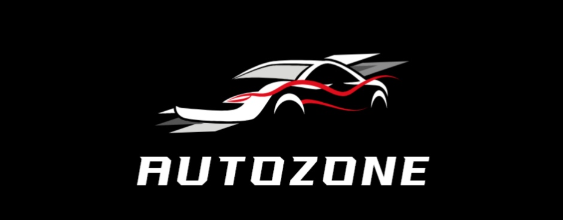

# AutoZone Motor City Online

## Project
AZMCO is an open source implementation of Electronic Arts' [Motor City Online](https://en.wikipedia.org/wiki/Motor_City_Online) from 2001 as well as its offline launcher.

## Goals
There are multiple goals this project tries to achieve:
1. Learn how games were made in an era when things had to be done in the code, and not through fancy game engines like today.
2. Have a fully playable game implemented end-to-end, including resource management, audio, and video rendering, as well as support of large screen resolutions.
3. Eventually, to support 64-bit compilation for modern systems, and provide an avenue for development of modern renderer implementations such as DirectX or Vulkan.
4. Also, eventually, to support modern input devices that do not comply with DirectInput, and even port to Linux or Mac.

## Requirements & Dependencies
1. [Microsoft Visual Studio](https://visualstudio.microsoft.com/downloads/)

## Notes
### Compatibility, Code Style & Standards
In order to be able to run the code not only in the modern operating systems, but also in legacy environments, such as Windows XP, the code base has to abstain from usage of modern C++ language features.

Modern Visual Studio makes the binary dependent on modern runtime libraries that are not available in the legacy systems, therefore the game won't work. In order to make the code work on legacy systems please see [detailed instructions on compatibility](COMPATIBILITY.MD).

### Renderer Modules
The renderer modules were implemented with minor changes, such as omission of write-only variables, making calls to functions when result is not used, as well as addition of configuration file and reading values from it, which is useful in a few cases.

#### DirectX 7
The original game shipped with DirectX 7 renderer. The renderer is very similar to the ones in the Need For Speed series, since it is evolution of the same engine.

1. DirectX 7 A is a renderer based on the original file `dx7z.dll` version: 2001.06.21.1418 (8195.6.33.55.5144). It is important to note that the game does not work with either this renderer nor its original, however it is fully functional for predecessor games such as Neer For Speed Hot Pursuit and High Stakes.

### Other Modules
The game also contains Compress and Implode modules, functionality of each is described below.

#### Compress
The Compress.dll module is not used by the game. This module is a wrapper around the implode.dll with some quality of life additions.

#### Implode
The game uses Implode.dll module for data compression.

PKWARE DCL Implode is a compressed data format associated with PKWARE Data Compression Library (DCL). The game uses the library version 1.11, which is identifiable by the following string:
`PKWARE Data Compression Library for Win32\r\nCopyright 1989-1995 PKWARE Inc. All Rights Reserved.
Patent No. 5,051,745
PKWARE Data Compression Library Reg. U.S. Pat. and Tm. Off.\r\nVersion 1.11`.

## Similar & Related Projects
### Predecessors
1. [AutoZone High Stakes](https://github.com/americusmaximus/AZHS)
2. [AutoZone Hot Pursuit](https://github.com/americusmaximus/AZHP)

### Server
1. [Rusty Motors Racing Server](https://github.com/rustymotors/server)

## Thanks
1. [Reddit](https://www.reddit.com/) for providing [Motor City Online](https://www.reddit.com/r/needforspeed/comments/12xz4ce/do_you_guys_remember_motor_city_online_and_if_so/) and the offline patch.
2. [Ladislav Zezula](https://github.com/ladislav-zezula) for the implementation of PkWare's implode algorithm within his [StormLib](https://github.com/ladislav-zezula/StormLib).

## Legal
1. This is not a complete game. Please purchase software you like!
2. The source code in this repository is mostly produced by reverse engineering the original binaries. There are a couple of exceptions for reverse engineering under DMCA -- documentation, interoperability, fair use. See goals section for the interoperability and fair use cases. The documentation is needed to support those. Also please see an article about [software preservation](https://en.wikipedia.org/wiki/Digital_preservation).
3. Motor City Online, Need For Speed, DirectX, OpenGL, Vulkan, and others are trademarks of their respective owners.

